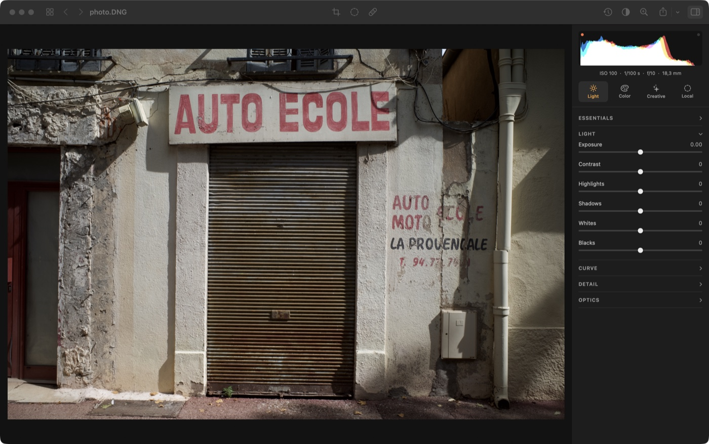
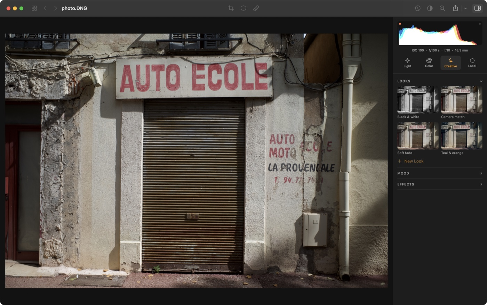
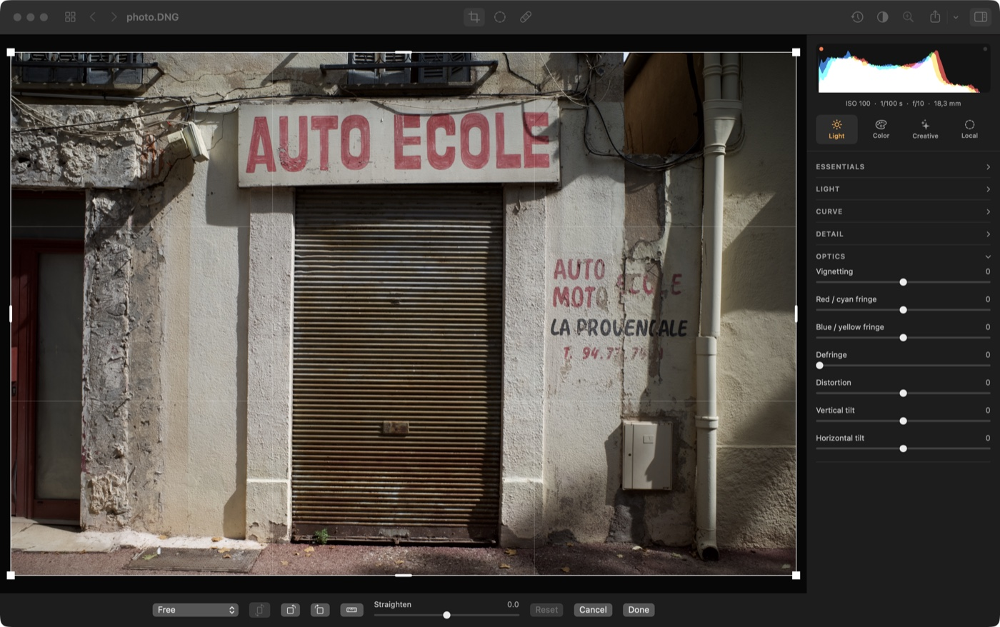

# SimpleRAW

**Develop your RAW photos, keep them in order, and have the whole library back itself up.**
A native macOS app, in one window, built on the RAW engine already in your Mac.

```sh
curl -fsSL https://raw.githubusercontent.com/yoanbernabeu/SimpleRAW/main/scripts/install.sh | sh
```

macOS 15 or later. Free, open source, MIT.



## Developing

Every slider moves the photograph as you drag it. The preview is decoded at the size of your
screen rather than at twenty-four megapixels, which is what keeps that true at sixty frames a
second.

- **Light** — exposure, contrast, highlights, shadows, whites, blacks, point curves per
  channel. **Auto** (⌘U) sets light and colour from the photograph itself.
- **Colour** — white balance with an eyedropper, vibrance, saturation, an HSL mixer band by
  band, colour grading on three wheels, black and white with a filter.
- **Presence** — dehaze, clarity, structure, at three scales. Glow and grain.
- **Optics** — vignetting, chromatic aberration, distortion, defringing, keystone. A level
  tool: draw a line along a horizon and the picture straightens to it.
- **Local** — layers with gradient, radial and brush masks, or a subject and a person the
  machine finds and your brush corrects. Each layer can be held to a range of tones.
- **Spot removal** — a click for a blemish; drag along a wire and the whole line is healed at
  once, with one offset from end to end.
- **Looks** you can dial back from 100 % to nothing, moods from `.cube` LUTs, crop and rotate,
  100 % view, soft proofing against a paper profile.

Non-destructive. Your originals are never written to.

| Looks, as thumbnails of your own photograph | Crop, rotate, straighten |
|---|---|
|  |  |

## The library

Import a folder or a card (⇧⌘I) — originals are copied in, never moved, duplicates skipped.
Ratings, flags, colour labels, keywords, albums and smart albums, and filters over all of it.
Compare two photographs (`C`), loupe on the space bar, filmstrip under the develop view.
Copy settings from one photograph onto fifty, export with a preset, develop a whole shoot in
one pass.

## Backing up

The part most catalogues leave to you.

Point the app at any S3-compatible storage in Settings (⌘,) — AWS, Scaleway, OVH, Backblaze B2,
Cloudflare R2, MinIO. It then backs itself up on its own, after an import and on the way back
from developing: originals, exports, and the catalogue with every rating, keyword, album and
edit. Keys live in your Keychain. **Nothing is ever deleted from the bucket.**

Before you rely on it:

- **The bucket must already exist** — the app never creates one. Keep it private.
- **The app encrypts nothing.** Your provider, and whoever holds the keys, can read everything.
  Turn on server-side encryption, and versioning or Object Lock.
- **Give it a key that cannot delete**: `s3:ListBucket` on the bucket, plus `s3:PutObject`,
  `s3:GetObject` and `s3:AbortMultipartUpload` on `bucket/folder/*`.
- Every object carries its SHA-256. A restore checks each original against the catalogue, which
  catches damage — not tampering, since the catalogue comes from the same bucket.

## Which files

Whatever RAW your macOS reads (some nine hundred models), and anything that shoots DNG. Built
and measured against a Ricoh GR III. JPEG, HEIC, TIFF and PNG go through the same pipeline,
minus what only a RAW decoder can do — the app offers those controls only when they will do
something.

## Installing

```sh
curl -fsSL https://raw.githubusercontent.com/yoanbernabeu/SimpleRAW/main/scripts/install.sh | sh
```

Downloads the latest release, puts it in `/Applications`, takes the quarantine flag off.
[The script](scripts/install.sh) is twenty lines — read it before running it, as with anything
piped into a shell.

**Why that last step.** The app is sandboxed and hardened, with no escape of any kind, but it
is **signed ad-hoc**: no Apple Developer certificate, and notarisation needs one. So macOS
marks anything downloaded and Gatekeeper refuses it until the mark comes off. Right-click →
**Open**, once, does the same by hand. The sandbox lets the app reach the network and the files
you pick, and nothing else.

## The keyboard

**Library** — `0`–`5` rate · `P` `X` `U` pick, reject, unflag · `6`–`9` colour label · Space
loupe · `C` compare · Return opens. Right-click for albums, looks, pasting settings, exporting.

**Develop** — `G` back to the library, ⌘[ ⌘] step between photos.

| | | | |
|---|---|---|---|
| `\` | before / after | `C` | crop |
| `Z` | fit / 100 % | `M` | local adjustments |
| ⌘U | auto | `S` | spot removal |
| ⌘Z ⇧⌘Z | undo, redo | ⇧⌘R | reset everything |
| ⇧⌘C ⇧⌘V | copy, paste settings | ⌘E | export |
| ⌥⌘F | filmstrip | ⌥⌘I | inspector |

Double-click a slider's name to reset it. In the curve, click to add a point and drag it out to
remove it.

---

## For developers

Swift 6 and SwiftPM. No dependency but Apple's frameworks and `swift-argument-parser`. A recent
Xcode to build; the Command Line Tools alone work if you can do without the one Metal kernel,
which the build treats as optional.

```sh
make run [FILE=photo.dng]   # from the source tree, outside the sandbox
make app                    # the bundle that ships: sandboxed, hardened, ad-hoc signed
make test                   # the suite; needs nothing but the repository
make test-s3                # and the backup, against a throwaway MinIO in Docker
make bench                  # replays every gesture; fails over the 16 ms frame budget
make gestures               # drives the real app with real mouse events
```

`make run` is the unwrapped executable — what the benchmarks drive, and the only honest way to
judge responsiveness, a debug build being five hundred times slower at building a lookup table.
The wrapped app ignores every launch argument.

End-to-end tests want a DNG in `Samples/` (git-ignored) and skip themselves without one:
[a CC0 one](https://raw.pixls.us/data/Ricoh/GR%20III/R0000357.DNG).
[`CLAUDE.md`](CLAUDE.md) is the map — what lives where, and the gotchas that cost a day each.

### The command line

```sh
simpleraw info photo.dng                     # what the engine knows about a file
simpleraw develop photo.dng -o out.jpg --exposure 0.5 --shadows 50 --contrast 20
simpleraw develop photo.dng --adjustments look.json --long-edge 2048
simpleraw batch shoot/*.dng --preset "Camera match" --export "Web 2048" -o out/
simpleraw presets                            # the looks and export presets there are
simpleraw noise photo.dng                    # what can be done about the noise in it
```

Sliders run -100 to +100 (0 to 100 for sharpness and noise reduction); exposure is in EV.

### A look by hand

JSON in `Application Support/SimpleRAW/Presets`, the file name being the name of the look. A
partial document is enough, and it replaces only the groups it mentions:

```json
{ "contrast": 20, "shadows": 35, "vibrance": 15 }
```

## License

[MIT](LICENSE)
